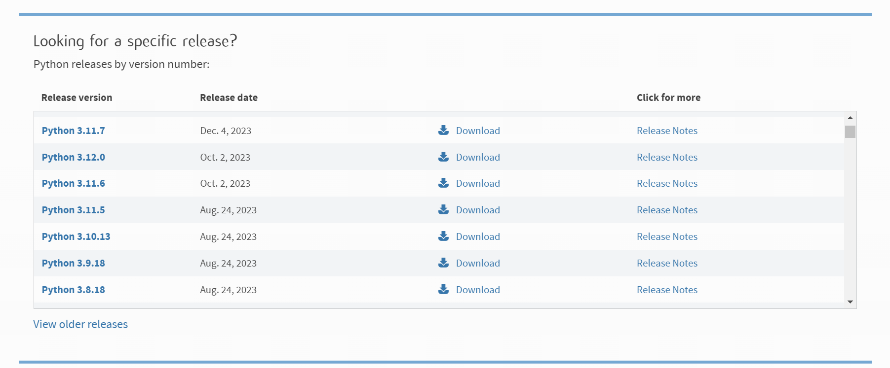
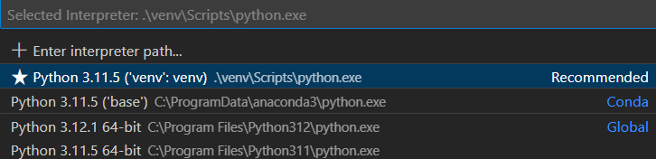
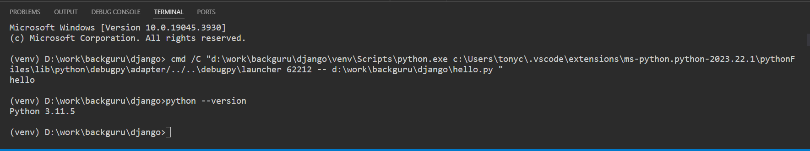

# LLM (Large Lnaguage Model) 애플리케이션 개발

Github permission 에러 발생 시 [ssh-key 추가하기](https://medium.com/@su_bak/git-github-com-permission-denied-publickey-%EC%97%90%EB%9F%AC-%ED%95%B4%EA%B2%B0-%EB%B0%A9%EB%B2%95-76b0ab741c62) 를 참고한다.

**목차**
- [개발 환경 설정](#개발-환경-설정)
- [파이썬 모듈 설치하기](#파이썬-모듈-설치하기)
- [Examples](#examples)

## 개발 환경 설정
아래 항목들을 설치하여 개발환경을 설정한다.
- 파이썬 다운로드 및 설치
- 파이썬 가상 환경 생성
- Visual Studio Code 다운로드 및 설치

원할한 실습을 위해 파이썬 3.11.5 버전을 [다운로드](https://www.python.org/downloads/) 받는다.



이제 원하는 폴더에서 cmd창을 열어 `py -version -m venv {가상환경이름}` 명령으로 가상 환경을 생성한다. VSCODE terminal에서 아래 명령과 같이 가상환경을 생성할 수 있다.

```bash
py -3.11 -m venv myvnen3.11
```

이제 Visual Studio code를 [다운로드](https://code.visualstudio.com/download) 받아 설치한다. 그리고 파이썬 코드를 실행할때 사용할 interpreter를 앞서 생성한 가상환경으로 지정해 준다. `shift+ctrl+p`를 눌러 `interpreter'라고 입력하면 아래 그림과 같은 화면이 나오면 방금 생성해 준 가상환경을 선택 해 주면 된다.



그리고 VSCODE내의 터미날 창에서 가상환경이 활성화 되어 있는지 확인이 가능하며 버전을 출력해 볼 수 있다.



## 파이썬 모듈 설치하기
랭체인은 openAI와 같은 LLM (Large Language Model) framework이다. 랭체인을 이용해서 LLM을 좀 더 빠르고 쉽게 개발할 수 있다 (https://python.langchain.com/docs/get_started/introduction). 파이썬에서 랭체인을 이용하기 위해서는 [여기](https://python.langchain.com/docs/get_started/quickstart)를 참조하여 기본적으로 필요한 모듈을 VSCODE terminal에서 설치한다. 

``` bash
pip install langchain
pip install langchain-openai
```

FAISS 벡터 DB를 이용하기 위해서는 아래와 같은 모듈을 설치한다.
```bash
pip install faiss-cpu
```
이외에 여러가지 모듈이 필요한데, VSCODE terminal에서 아래 명령을 입력하여 필요한 패키지를 한번에 모두 설치할 수 있다.
```bash
pip install -r requirements.txt
```

## Examples
- [QA with RAG](openai/examples/README.md): PDF를 읽어와서 벡터 데이터를 생성하고 사용자 질의에 응답하는 애플리케이션