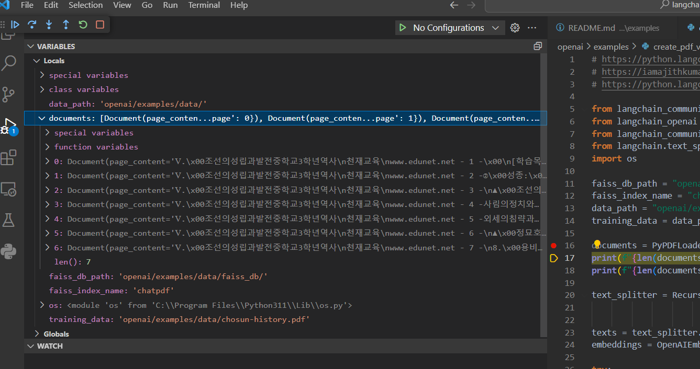
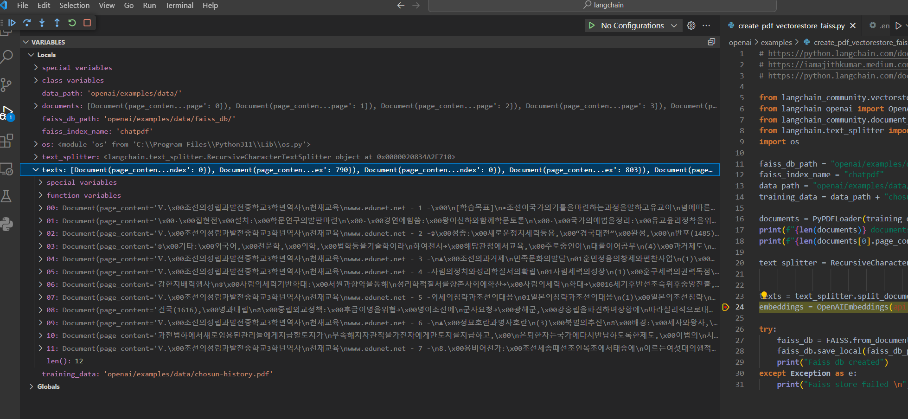
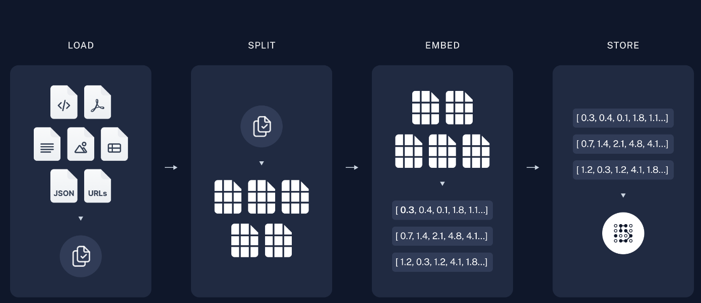
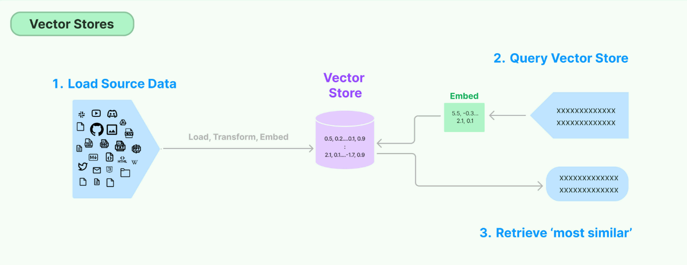

# Q&A with RAG

RAG (Retrieval Augmented Generation)이란 사용자가 질문을 할 때 LLM은 자동으로 질문 문장과 가장 유사한 문장을 벡터 데이터베이스에서 검색해서 LLM에 사용자 질문과 같이 입력으로 전달하고 LLM이 검색된 문장을 힌트로 삼아 질문에 답하는 방식이다.

**목차**
- [파이썬 소스코드](#파이썬-소스코드)
- [참고할 만한 사이트](#참고할-만한-사이트)
- [벡터데이터 생성하기](#벡터-데이터-생성하기)
- [벡터데이터 탐색하고 질의응답하기](#벡터-데이터-탐색-및-질의응답)

## 파이썬 소스코드
- `crete_pdf_vectorestore_faiss.py`: pdf 파일을 읽어와서 벡터 인덱스 데이터를 만들어 본인 컴퓨터에 index 데이터를 저장하는 역할을 하는 파이썬 코드
- `qa_pdf_vectorestore_faiss.py`: 위에서 생성한 index 데이터를 불러와서 질문에 답변하는
chatbot역할을 하는 파이썬 코드

## 참고할 만한 사이트
- https://python.langchain.com/docs/use_cases/question_answering/
- https://python.langchain.com/docs/modules/data_connection/vectorstores/
- https://iamajithkumar.medium.com/working-with-faiss-for-similarity-search-59b197690f6c
- https://python.langchain.com/docs/modules/data_connection/document_loaders/pdf

## 벡터 데이터 생성하기
- 해당 소스 코드: `crete_pdf_vectorestore_faiss.py`
- 벡터 데이터베이스: facebook에서 만든 [FAISS](https://github.com/facebookresearch/faiss)를 사용한다.
- Text splitter: RecursiveCharacterTextSplitter를 사용하여 긴 텍스트를 작은 길이로 쪼갠다.

이 파일의 주 목적은 임의의 PDF 파일을 읽어와 openai에서 제공하는 `text-embedding-ada-002` 모델(https://platform.openai.com/docs/models/embeddings)을 이용하여 임베딩 벡터를 만들고 FAISS 데이터베이스를 로컬 노트북에 생성하여 임베딩 벡터 데이터를 저장한다. 

openai를 사용하기 위해 우선 `API_KEY`가 필요하다. 해당 키를 생성하기 위해서는 openai에 가입을 하고 카드 결제를 해야 한다 
- 가입하고 키 발급하는 방법: https://www.daleseo.com/chatgpt-api-keys/ 

그리고 발급받은 키를 코드에서 여러 방법으로 사용할 수 있다. 
- 발급 받은 키 사용방법: https://platform.openai.com/docs/quickstart/step-2-set-up-your-api-key 

이번 소스코드에서는 `.env`파일을 프로젝트 루트 디렉토리에 만들어서 아래와 같이 API_KEY를 설정하여 코드에서 사용한다. API_KEY값은 외부로 유출되지 않도록 조심해야한다. 유츌되어 다른 사람이 사용하면 요금을 내가 지불해야한다.

```python
API_KEY=xxxxxxxxxxxxxxxxxxxxxxxxxxxxxxxxxxxxxxxxxxxxxxxxxxxxxxxxx
```

코드에서 사용하는 방법은 다음과 같다.
```python
import os
embeddings = OpenAIEmbeddings(api_key=os.environ.get("API_KEY", "<your OpenAI API key if not set as env var>"))  
```

아래 코드는 각종 변수를 선언하는 부분이다.

```python
faiss_db_path = "openai/examples/data/faiss_db/"
faiss_index_name = "chatpdf"
data_path = "openai/examples/data/"
training_data = data_path + "chosun-history.pdf"
```

여기서는 `chosun-history.pdf` 파일을 읽어와 벡터 데이터를 만들어 FAISS를 이용하여 자신의 로컬 컴퓨터에 저장한다.

이제 `PyPDFLoader`를 이용해서 PDf파일을 로드한다.
```python
documents = PyPDFLoader(training_data).load()
```
VSCODE 디버거를 이용해서 반환되는 `documents`를 살펴 보면 아래 그림과 같이 `Document` 타입의 객체로 구성된 배열이라는 것을 알 수 있다. PyPDFLoader.load()함수는 각 페이지마다 Document객체를 생성하여 리턴한다.



`chosun-history.pdf` 파일은 총 7장으로 구성되어 있고 각 페이지의 내용이 `Document`객체로 만들어져 있다. `Document`객체는 `page_content`와 metadata로 구성된 객체이다. 그런데 한 페이지마다 글자수가 너무 많아 openai model에 모두 입력되지 않는 경우가 있다. 각각의 openai model은 한번에 처리할 수 있는 토큰수가 정해져 있다. (참고: https://platform.openai.com/docs/models/models) 따라서, 한 페이지 분량의 글자를 작은 단위로 쪼개는 작업이 필요하고 쪼개진 작은 단위를 각각 chunk라고 한다. 아래 코드는 랭체인에서 제공하는 splitter를 이용해서 documents를 chunk단위로 쪼개는 작업을 수행한다. 1개의 chunk는 최대 1000개의 문자를 포함하며 각각의 chunk마다 200개 문자를 중첩해서 가지도록 설정하였다. (LLM이 좀 더 연관있는 chunk를 구분하고 탐색하기 위해)

```python
text_splitter = RecursiveCharacterTextSplitter(chunk_size = 1000,
                                               chunk_overlap=200,
                                               add_start_index=True)
texts = text_splitter.split_documents(documents)
```

디버거로 리턴값 `texts`를 확인해 보면 아래와 같다.



위에서 documents와 비교해 보면 더 작은 단위로 쪼개져 document 객체가 12개로 늘어난 것을 볼 수 있다. 이제 잘게 쪼갠 chunk데이터를 embedding 모델에 입력으로 넣어 주어 임베딩 벡터 데이터를 만들도록 한다. 그리고 FAISS 데이터베이스를 생성하여 만들어진 벡터 데이터를 로컬 피시에 저장한다.

```python
embeddings = OpenAIEmbeddings(api_key=os.environ.get("API_KEY", "<your OpenAI API key if not set as env var>"))  
 
try:
    faiss_db = FAISS.from_documents(texts, embeddings)    
    faiss_db.save_local(faiss_db_path, index_name=faiss_index_name)
    print("Faiss db created")
except Exception as e:
    print("Faiss store failed \n", e)
```
소스코드에서 지정한 경로에 실제 faiss db가 생성되었는지 확인해 본다. PDF파일을 불러와서 벡터 데이터 생성하는 절차는 다음과 같이 정리할 수 있다.



- `Load`: 데이터를 [DocumentLoaders](https://python.langchain.com/docs/modules/data_connection/document_loaders/)를 이용하여 로드하는 작업
- `Split`: [Text SPlitters](https://python.langchain.com/docs/modules/data_connection/document_transformers/)를 이용하여 대량의 document를 작은 chunk 단위로 쪼개는 작업
- `Store`: chunk단위로 조각난 데이터를 저장하고 인덱싱하는 작업으로 [Embedding](https://python.langchain.com/docs/modules/data_connection/text_embedding/) 모델을 이용해서 vector data를 생성하고 [VectorStore](https://python.langchain.com/docs/modules/data_connection/vectorstores/)에 저장

- `Retrieve`: 사용자의 질의가 있을대 [Retriever](https://python.langchain.com/docs/modules/data_connection/retrievers/)를 이용하여 위에서 생성한 저장소에서 연관데이터를 검색하고 가져오는 작업
- `Generate`: LLM이 사용자의 질문과 연관된 데이터를 수집하여 prompt를 생성하고 그에 상응하는 대답을 생성 하는 작업

## 벡터 데이터 탐색 및 질의응답
- 해당 소스 코드: `qa_pdf_vectorestore_faiss.py`
`create_pdf_vectorstore_faiss.py`가 정상적으로 실행되었다면, `data/faiss_db/chatpdf` DB가 생성되며 이제 사용자 질문에 응답하는 코드를 작성한다.

질의응답을 위해 사용하는 AI모델은 아래 코드와 같이, GPT4 또는 GPT3를 선택할 수 있다. 좀 더 정확한 답변을 위해서는 GPT4를 사용하는 것이 좋다.

```python
# GPT_MODEL = "gpt-3.5-turbo"
GPT_MODEL = "gpt-4"
```
사용할 벡터 데이터베이스는 아래 코드와 같이 앞서 생성한 위치를 지정한다.

```python
faiss_db_path = "openai/examples/data/faiss_db/"
faiss_index_name = "chatpdf"
```
FAISS 데이터베이스를 저장하는 방법은 `faiss_db.save_local`을 이용하는 반면에 다시 불러오기 위해서는 아래 코드와 같이 작성한다. 저장할 때와 동일한 embedding model을 사용하여 로드한다.

```python
embeddings = OpenAIEmbeddings(api_key=os.environ.get("API_KEY", "<your OpenAI API key if not set as env var>"))    

try:
    faiss_db = FAISS.load_local(faiss_db_path, embeddings, index_name=faiss_index_name)
    print("Faiss db loaded")
except Exception as e:
    print("Faiss db loading failed \n", e)
```

이제 vectore store (FAISS DB)를 좀 더 쉽게 사용하기 위해 langchain에서 제공하는 retriever를 이용할 수 있다. 여기서는 간단하게 [vectore store-backed retriever](https://python.langchain.com/docs/modules/data_connection/retrievers/vectorstore) 를 사용한다. Vectore store retriever는 백터 데이터베이스 앞단에 retriever라는 것을 두어 코드에서 좀 더 쉽게 벡터 데이터를 불러와서 사용할 수 있도록 한다.



즉, 사용자가 질문을 하면 retriever가 앞서 pdf 파일을 임베딩 벡터 데이터로 변환한 것 처럼 동일하게 자동으로 사용자 질문을 벡터 데이터로 변환하고 벡터 데이터베이스에서 검색을 해서 가장 비슷한 벡터값을 찾아 그 값에 해당하는 문장을 찾아 온다. 그리고 검색한 문장을 prompt에 붙혀서 LLM에 질문을 한다. 마지막으로 LLM은 검색된 문장을 이용해서 답변을 한다. 이것은 마치 책을 펴 놓고 문제에 답을 찾아 대답하는 것과 동일한 논리이다. 아래 그림은 RAG 동작 방식을 나타낸다.


아래 코드는 Prompt template을 생성하고 질문에 답변하는 gpt 모델을 설정하는 부분이다. 여기서는 GPT-4를 기본으로 사용하고 있다. prompt template에 대해서는 [여기](https://python.langchain.com/docs/expression_language/cookbook/prompt_llm_parser)를 참고한다.

```python
template = """아래의 context 내용을 기반으로 답변합니다. 만약 context에서 내용을
찾을 수 없다면 "죄송합니다. 답변을 찾을 수가 없습니다."로 답변을 합니다.
:{context}

Question: {question}
""" 

prompt = ChatPromptTemplate.from_template(template)
llm = ChatOpenAI(api_key=os.environ.get("API_KEY", "<your OpenAI API key if not set as env var>"),
                 model=GPT_MODEL)

# RAG pipeline
chain = (
    {"context": retriever, "question": RunnablePassthrough()}
    | prompt
    | llm
    | StrOutputParser()
)
```
위 코드에서 `retriever`는 사용자 질문과 가장 유사한 문장을 벡터 데이터베이스에서 검색하여 prompt template에 전달해 주는 역할을 한다. `RunnablePassthrough()`를 사용하여 사용자 질문 문장을 그대로 prompt template에 전달하여 최종적으로 LLM에 전달하는 문장을 완성한다. 예를 들어 "훈민정음은 누가 창제했나요?"라고 질문을 하면 다음과 같이 템플릿을 완성하여 전달한다.

```bash
아래의 context 내용을 기반으로 답변합니다. 만약 context에서 내용을 찾을 수 없다면 "죄송합니다. 답변을 찾을 수가 없습니다."로 답변을 합니다.

:여기에 retriever가 검색한 문장이 추가됨

Question: 훈민정음은 누가 창제했나요?
```

결국 gpt는 위와 같이 질문뿐만 아니라 질문과 가장 유사한 문장과 함께 입력받아 그것을 보고 답변을 하는 것이다. 이것이 RAG의 핵심내용이다.

마지막으로 사용자 질문을 터미널에서 입력받아 LLM에 전달하는 코드이다.

```python
while True:
    user_question = input("Question (Type 'q' to quit): ")
    if user_question.lower() == 'q':
        break
    # print(chain.invoke("What is the number of training tokens for LLaMA2?")) 
    print(chain.invoke(user_question)) 
```

`q`를 입력할 때 까지 사용자가 질문을 입력할 수 있다.